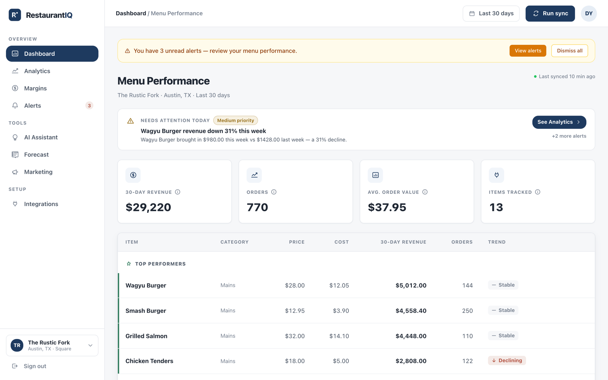
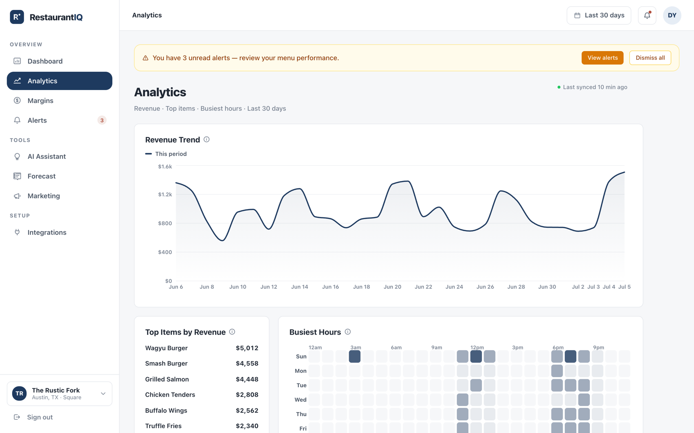
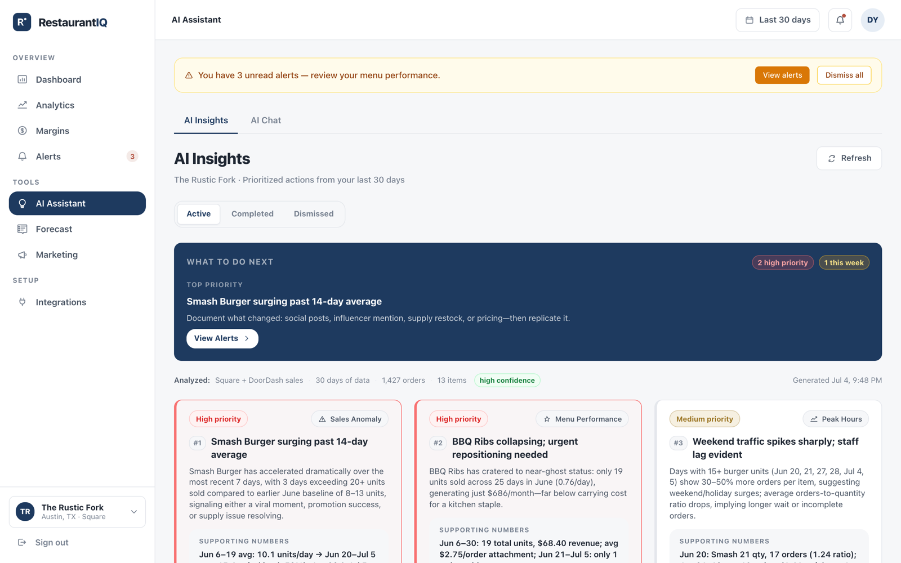
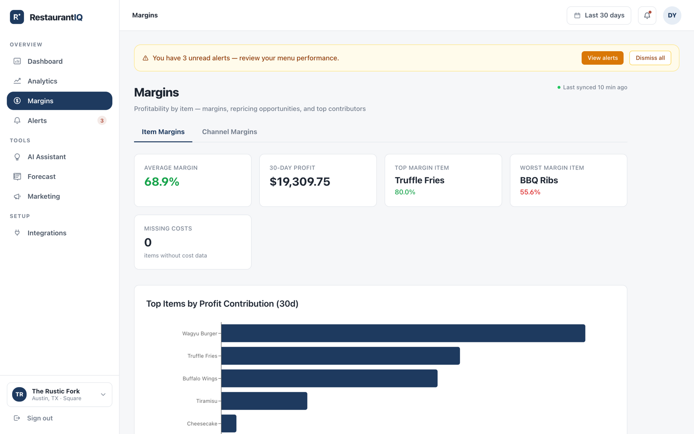
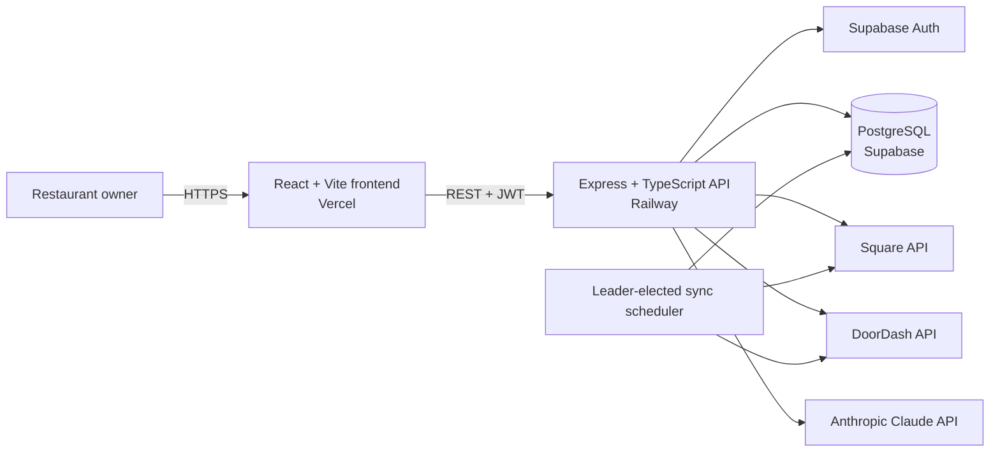

# RestaurantIQ

[](https://github.com/dy1an-nt/RestaurantIq/actions/workflows/ci.yml)
[](LICENSE)
[](RestaurantIQ/docs/schema.md)

**Restaurant analytics and AI advisory software for independent operators.** RestaurantIQ combines Square and DoorDash order data, calculates menu performance and margins, and turns those numbers into prioritized actions.

**Pilot status:** deployment configuration targets Vercel and Railway. A verified public demo URL is not currently published.



## Why I built it

I have worked in food service and spent a lot of time around the POS. The register captures every order, item, rush, and slow period, but the reporting usually stops at sales totals. The operator still has to decide what to promote, reprice, or remove while running the restaurant.

Delivery creates another gap. Square and DoorDash report their numbers separately, which makes it difficult to understand how the same dish performs across in-house and delivery channels. I built RestaurantIQ to combine those sources, calculate margins without inventing missing costs, and give an owner a short list of actions grounded in their own data.

## What restaurant owners can do

- **See menu performance:** compare revenue trends, top and bottom items, week-over-week movement, and time-of-day demand.
- **Measure margins honestly:** enter item costs and compare in-house and delivery economics without treating an unknown cost as zero.
- **Act on alerts:** catch items with no sales, meaningful declines, and new top performers through deterministic rules.
- **Review AI recommendations:** receive structured suggestions with priorities, supporting numbers, expected impact, and links back to the relevant product screen, then ask follow-up questions in a data-grounded chat.
- **Plan purchasing:** view seven-day item forecasts calculated in TypeScript, with Claude used only to explain the completed forecast in business language.
- **Create marketing ideas:** generate social captions and concrete promotions from recent item performance.

## Product views

| Analytics | AI insights |
|---|---|
|  |  |
| Revenue, item performance, and daypart demand | Recommended actions with evidence and priority |



## System architecture



| Layer | Technology |
|---|---|
| Frontend | React 18, TypeScript, Vite, Tailwind CSS, Recharts |
| Backend | Node.js, Express, TypeScript |
| Data and auth | PostgreSQL and Supabase Auth |
| AI | Anthropic Claude API with schema-constrained tool use |
| Integrations | Square Node SDK and DoorDash OAuth2 API |
| Deployment target | Vercel and Railway |
| Quality gates | Jest, Supertest, TypeScript, ESLint, production builds, and dependency audit in CI |

## Engineering decisions

### [Keep distributed sync work durable](RestaurantIQ/docs/case-studies/distributed-sync.md)

Multiple backend instances must not ingest the same restaurant simultaneously. I chose three coordination layers:

- A PostgreSQL session-level advisory lock elects one scheduler leader.
- A conditional update prevents overlapping work for the same restaurant and provider.
- PostgreSQL stores the job history and retry schedule so retries survive restarts and deploys.

The leader lock uses a dedicated [`pg.Client`](RestaurantIQ/restaurantiq-backend/src/services/scheduler/leaderElection.ts). PostgREST cannot safely hold a session-level lock because each HTTP query may use a different pooled connection. Retry state is handled in [`syncJobs.ts`](RestaurantIQ/restaurantiq-backend/src/services/scheduler/syncJobs.ts), not an in-memory timer queue.

### [Preserve financial meaning](RestaurantIQ/docs/case-studies/financial-correctness.md)

RestaurantIQ stores and transfers money as integer cents. An unknown item cost remains `null`; it is not coerced to zero and displayed as a false 100% margin. Delivery commission uses basis points and integer arithmetic. The tradeoff is more explicit code, but the result is reviewable and avoids floating-point drift in financial calculations.

The cross-channel calculation is isolated in [`channelMarginService.ts`](RestaurantIQ/restaurantiq-backend/src/services/channelMarginService.ts) and pinned by unit tests.

### [Keep forecasting math outside the LLM](RestaurantIQ/docs/case-studies/deterministic-ai-forecasting.md)

I separated deterministic computation from generated explanation. [`forecastService.ts`](RestaurantIQ/restaurantiq-backend/src/services/forecastService.ts) calculates projections, limits extreme swings, and assigns confidence from available history. Claude receives those completed numbers and writes the narrative. It never chooses unit counts or performs the forecast math.

This boundary makes the business calculation repeatable, testable, and inexpensive. A normal `GET` reads the cached forecast; manual refresh is the user-triggered operation that may spend AI tokens, while automatic generation is interval-gated after a sync.

### [Treat tenant isolation as a testable boundary](RestaurantIQ/docs/case-studies/tenant-isolation.md)

Protected requests derive restaurant access from the authenticated user's identity instead of trusting a client-supplied restaurant ID. Shared middleware resolves the tenant, and database access remains restaurant-scoped. HTTP-level isolation tests exercise the protected route surface and attempt cross-tenant access.

See [`requireRestaurant.ts`](RestaurantIQ/restaurantiq-backend/src/middleware/requireRestaurant.ts) and [`tenantIsolation.test.ts`](RestaurantIQ/restaurantiq-backend/src/routes/__tests__/tenantIsolation.test.ts).

## Testing and verification

The backend has unit, integration, scheduler, ingestion, encryption, HTTP route, and tenant-isolation tests. CI runs backend typechecking, linting, tests, and a production dependency audit. It also typechecks, lints, builds, and audits the frontend.

Exact test totals are intentionally omitted because the suite changes frequently. The [CI workflow](.github/workflows/ci.yml) is the current source of truth. One known gap remains: the frontend has no automated runtime test suite yet.

```bash
cd RestaurantIQ/restaurantiq-backend
npm run typecheck
npm test
```

## My role and use of AI tools

RestaurantIQ is my solo project. I own the product scope, architecture, implementation decisions, validation, deployment work, and documentation. I use AI coding tools to accelerate implementation, compare approaches, and run adversarial reviews. I remain responsible for accepting or rejecting changes, checking APIs against the source, reviewing diffs, and running the quality gates.

The project records decisions and failures instead of presenting a perfect build story. Examples include the [bug log](RestaurantIQ/docs/bugs.md), [schema design notes](RestaurantIQ/docs/schema.md), and [known limitations](RestaurantIQ/docs/known-limitations.md).

## Current status

The application is being prepared for a small restaurant pilot. The repository includes Vercel and Railway deployment configuration, but a verified public demo URL is not currently published. Current product constraints include:

- One restaurant location per account
- Square and DoorDash integrations only
- Manual integration credential setup
- A fixed analytics window and no CSV or PDF export
- No automated frontend runtime tests

The complete gap list is maintained in [`known-limitations.md`](RestaurantIQ/docs/known-limitations.md). Pilot operations are tracked in [`pilot-checklist.md`](RestaurantIQ/docs/pilot-checklist.md).

## Local development

Prerequisites: Node.js 22+, a Supabase project, and the required environment values documented in each package's `.env.example`. The backend currently requires an Anthropic API key at startup. Square and DoorDash credentials are needed when connecting those integrations.

```bash
git clone https://github.com/dy1an-nt/RestaurantIq.git restaurantiq
cd restaurantiq/RestaurantIQ/restaurantiq-backend
cp .env.example .env
npm ci
npm run typecheck
npm run dev
```

In a second terminal:

```bash
cd restaurantiq/RestaurantIQ/restaurantiq-frontend
cp .env.example .env
npm ci
npm run dev
```

The frontend runs at `http://localhost:5173` and calls the backend at `http://localhost:3001` by default. See [`deployment.md`](RestaurantIQ/docs/deployment.md) for the complete environment and deployment guide.

## Documentation

- [`docs/README.md`](RestaurantIQ/docs/README.md): audience-based documentation map
- [`docs/case-studies/`](RestaurantIQ/docs/case-studies/): first-person engineering decisions, evidence, and tradeoffs
- [`docs/schema.md`](RestaurantIQ/docs/schema.md): schema diagrams and database decisions
- [`docs/bugs.md`](RestaurantIQ/docs/bugs.md): notable failures, diagnoses, fixes, and lessons
- [`docs/known-limitations.md`](RestaurantIQ/docs/known-limitations.md): current product and operational constraints
- [`docs/deployment.md`](RestaurantIQ/docs/deployment.md): Railway and Vercel deployment
- [`docs/operations.md`](RestaurantIQ/docs/operations.md): backup and recovery procedures
- [`docs/sprints-overview.md`](RestaurantIQ/docs/sprints-overview.md): historical build log
- [`docs/archive/`](RestaurantIQ/docs/archive/): preserved detailed sprint notes
