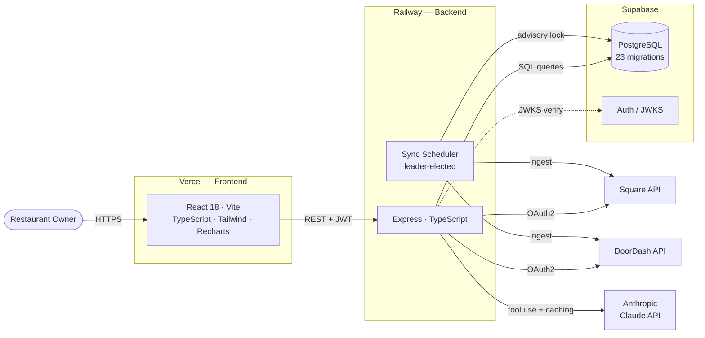
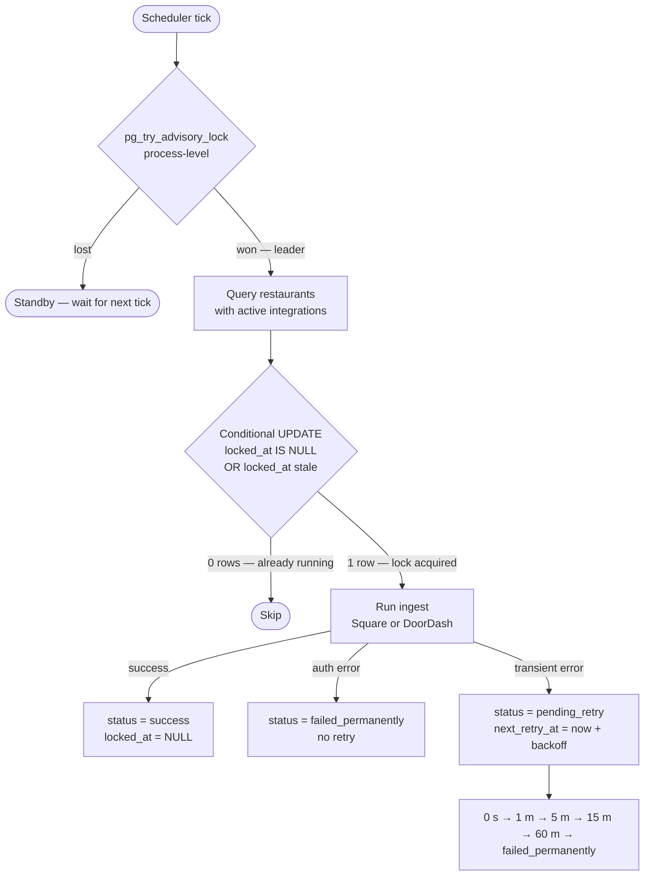
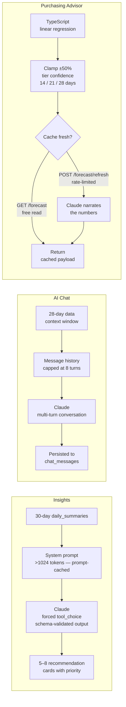

# RestaurantIQ

[](LICENSE)
[](docs/schema.md)

**Restaurant analytics and AI advisory platform.** Connects to Square POS and DoorDash, aggregates every order into a unified data layer, and surfaces AI-powered insights, forecasts, and a conversational assistant — all grounded in the restaurant's real numbers.

Live on Railway (backend) + Vercel (frontend).

---

## What it does

A restaurant owner connects their Square POS and DoorDash account once. From that point on, RestaurantIQ syncs their order history automatically, computes menu performance metrics, and makes the numbers actionable:

- **Analytics dashboard** — revenue trend, top/bottom items by revenue, time-of-day sales heatmap, week-over-week comparisons
- **Margin analysis** — true profit per dish once cost is entered, with a `null`-safe guard so uncosted items never report a fake 100% margin
- **AI Insights** — Claude reads 30 days of daily summaries and returns 5–8 prioritized, structured recommendations (what to reprice, promote, or cut), rendered as cards with priority triage
- **AI Chat** — multi-turn conversation grounded in the restaurant's last 28 days of data; context is attached per turn, capped at 8 turns to bound token cost, conversations persist
- **Purchasing Advisor** — TypeScript linear regression produces per-item demand forecasts; Claude narrates the finished numbers in business language. Math is deterministic and testable; the LLM never touches unit counts
- **Alerts engine** — deterministic rules flag items not selling, trending down 20%+, and new top performers; unread count surfaces in the sidebar and topbar
- **Marketing copy** — AI-generated social captions and promo ideas driven by actual item performance
- **Sync Health dashboard** — live view of the distributed sync scheduler: leader identity, per-provider success rates, recent job history, retry queue depth

---

## Tech stack

| Layer | Technology |
|---|---|
| Frontend | React 18, TypeScript, Vite, Tailwind CSS, Recharts |
| Backend | Node.js, Express, TypeScript |
| Database | PostgreSQL via Supabase (23 migrations) |
| Auth | Supabase Auth + custom JWT middleware (JWKS) |
| AI | Anthropic Claude API (forced tool use, prompt caching) |
| Integrations | Square Node SDK, DoorDash OAuth2 API |
| Hosting | Railway (backend) + Vercel (frontend) |
| Testing | Jest — 9 suites, 95 tests |



---

## Architecture highlights

### Distributed sync scheduler with leader election

The backend is designed to run as multiple instances simultaneously — Railway replicas, rolling deploys — without any two of them duplicating or dropping sync work. Three independent coordination layers:

| Layer | Mechanism |
|---|---|
| Which instance schedules at all | Postgres session-level advisory lock (`pg_try_advisory_lock`) |
| No two syncs overlap per restaurant | `integration_sync_status.locked_at` conditional UPDATE |
| Durable retry + audit trail | `sync_jobs` append-only table, 6-state lifecycle |

The advisory lock is held on a dedicated raw `pg.Client` for the process lifetime — not through Supabase's PostgREST layer, which would release it immediately on pool return. On crash or deploy, Postgres auto-releases the lock and a standby takes over within one scheduler tick.

Retry state lives entirely in Postgres — no `setTimeout`s, no in-memory queues. Retries survive crashes and deploys. Backoff schedule: 0s → 1m → 5m → 15m → 60m → `failed_permanently`. Auth failures go straight to permanent (no point hammering a dead credential).



### AI integration with cost controls

All Claude calls use **forced tool use** (`tool_choice: { type: 'tool', name: '…' }`), which validates output against a schema server-side — no prompt-engineering workarounds for JSON reliability. The system prompt is deliberately over 1024 tokens to qualify for Anthropic's **prompt caching**, cutting repeat-call input cost by ~90%.

The purchasing advisor separates concerns: TypeScript computes the linear regression, clamps projections to ±50% of last-week actuals, tiers confidence at 14/21/28 days, and refuses to forecast items with fewer than 14 days of history. Claude receives the finished numbers and writes only the narrative. `GET /forecast` is a pure cache read; `POST /forecast/refresh` is the only path that spends.



### Multi-tenant security

Every protected route validates a JWT against Supabase's JWKS endpoint. Every database query is scoped with `WHERE restaurant_id = $1` resolved from the authenticated user's `sub` — there is no path for a user to read another restaurant's data. OAuth tokens (Square, DoorDash) are AES-256-GCM encrypted at rest with key rotation support.

### Schema evolution

23 forward-only SQL migrations in `restaurantiq-backend/migrations/`. A custom migration runner (`src/scripts/migrate.ts`) applies them in order and records each in a `schema_migrations` table. No ORM — raw SQL throughout so every index, constraint, and query is explicit.

---

## Project structure

```
RestaurantIQ/
├── restaurantiq-backend/
│   ├── src/
│   │   ├── middleware/       # auth, rate limiting, error handling, chat daily cap
│   │   ├── routes/           # REST endpoints (analytics, insights, chat, advisor, …)
│   │   ├── services/
│   │   │   ├── scheduler/    # leader election, sync jobs, retry, metrics
│   │   │   ├── square/       # Square SDK ingestion + normalizers
│   │   │   ├── doordash/     # DoorDash OAuth ingestion + normalizers
│   │   │   └── ingestion/    # shared persistence layer (upsert pipeline)
│   │   ├── lib/              # token encryption
│   │   └── config/           # env validation, CORS
│   └── migrations/           # 23 SQL migrations
└── restaurantiq-frontend/
    ├── src/
    │   ├── pages/            # Dashboard, Analytics, Margins, AI Assistant, Advisor, …
    │   ├── components/
    │   │   ├── charts/       # Recharts wrappers (revenue trend, heatmap, top items)
    │   │   ├── chat/         # MessageThread, Composer, DailyCapBanner
    │   │   └── advisor/      # ForecastTable, NarrativePanel, InsufficientHistoryList
    │   └── lib/              # API clients, Supabase client, hooks
    └── vercel.json
```

---

## Key engineering decisions

**Functional core / imperative shell for the forecast.** `buildForecast` is a pure TypeScript function: same inputs, same numbers, always. It can be unit-tested without mocking anything. Claude receives the output and writes prose. Token-priced arithmetic is the most expensive calculator ever built; the math runs in microseconds for free.

**Denormalized `restaurant_id` on `chat_messages`.** Redundant with the parent `chat_conversations.restaurant_id`, but lets the per-day cap count hit a single-table index and makes every tenancy check a one-clause WHERE. Storage is cheap; joins on the hot path aren't.

**CQRS in miniature on the advisor.** `GET /forecast` never recomputes — it's a cache read. `POST /forecast/refresh` is the only path that runs Claude, and it's rate-limited. Page-load cost and a 12-second wait during navigation are different failure modes; the button label "Generating…" is a feature.

**No ORM.** Every query is raw SQL. Every index, constraint, and query plan is visible and intentional. The 23-migration history is the schema's changelog.

---

## Database schema

23 forward-only SQL migrations. Three Mermaid ER diagrams (core data, sync infrastructure, AI features) plus the design thought process — why multi-tenancy lives in a column, why daily summaries exist alongside raw orders, how the two-table sync architecture works, and why every token is stored as integer cents.

See [`docs/schema.md`](docs/schema.md).

---

## Bug log

16 documented bugs across the project — what broke, how it was diagnosed, what fixed it, and what the pattern tells you. Categories: React render timing, optimistic UI races, PostgREST quirks, Node module load order, distributed systems, deployment config, and schema edge cases.

See [`docs/bugs.md`](docs/bugs.md).

---

## Sprint history

Built over 16 sprints. See [`docs/sprints-overview.md`](docs/sprints-overview.md) for the full log.

| Sprints | What shipped |
|---|---|
| A–C | Square integration, JWT auth, live dashboard, Claude insights, deterministic alerts |
| D–E | Recharts analytics (trend, heatmap, top items), AI marketing copy |
| F–G | Alerts hardening, browser push notifications, guided onboarding, empty states |
| H–I | Margin analysis, menu item cost entry (unlocks true profit per dish) |
| J–K | DoorDash as second order source, shared ingestion pipeline, OAuth token encryption, 95 tests |
| L–L+ | Automated sync scheduler, distributed leader election, durable job queue with retry/backoff |
| M–N | Deployment config, CORS, rate limiting, security headers, health endpoint, runbooks |
| O | Brand design system (Tailwind theme, SVG icons, landing page, auth shell) |
| P | AI Chat, Purchasing Advisor, password reset, first production deploy (Railway + Vercel) |

---

## Local development

**Prerequisites:** Node 18+, a Supabase project, Square sandbox credentials, Anthropic API key.

```bash
# Clone
git clone https://github.com/dy1an-nt/RestaurantIQ.git
cd RestaurantIQ

# Backend
cd restaurantiq-backend
cp .env.example .env          # fill in your keys
npm install
npm run build
npm start                     # http://localhost:3001

# Frontend (separate terminal)
cd restaurantiq-frontend
cp .env.example .env          # set VITE_API_URL=http://localhost:3001
npm install
npm run dev                   # http://localhost:5173
```

**Environment variables** — see `.env.example` in each package for the full list. Required: `SUPABASE_URL`, `SUPABASE_SERVICE_ROLE_KEY`, `ANTHROPIC_API_KEY`, `TOKEN_ENCRYPTION_KEY` (32-byte hex). Optional: `DATABASE_URL` (enables distributed leader election; omit for single-instance dev), `SQUARE_*`, `DOORDASH_*`.

**Running tests:**
```bash
cd restaurantiq-backend
npm test              # 9 suites, 95 tests
```

---

## What to keep in mind

RestaurantIQ is a portfolio project and personal learning vehicle — it is not open for sign-ups and has no production data beyond the developer's own test restaurant. The `docs/` folder has the deployment runbook, migration guide, and operations notes if you want to understand how it's wired together.
