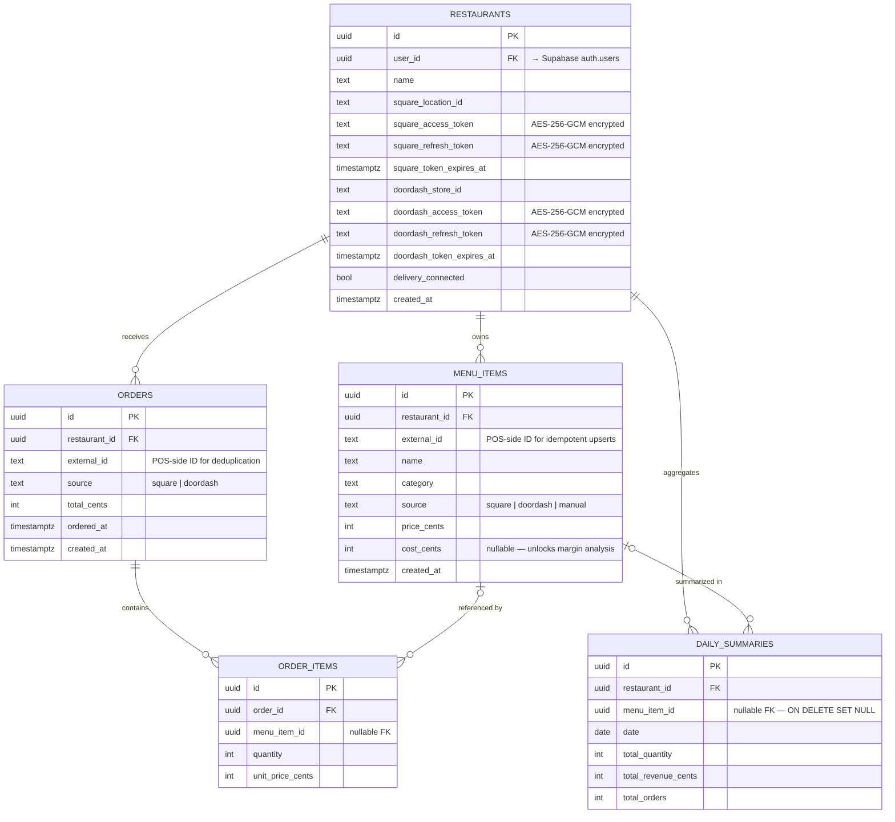
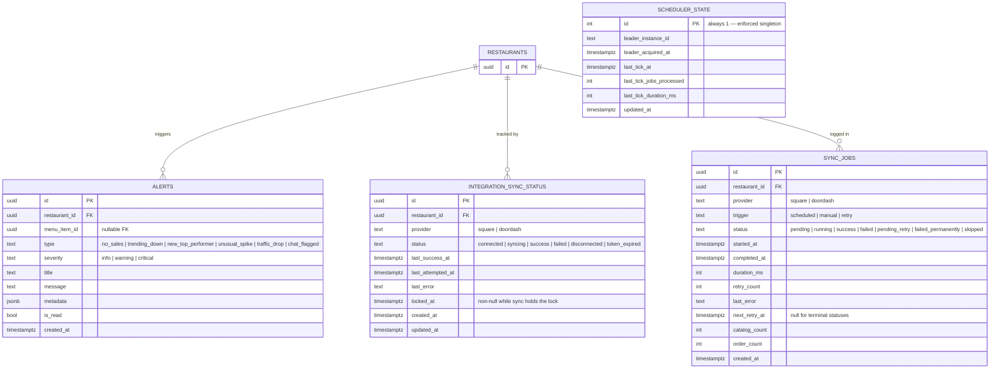
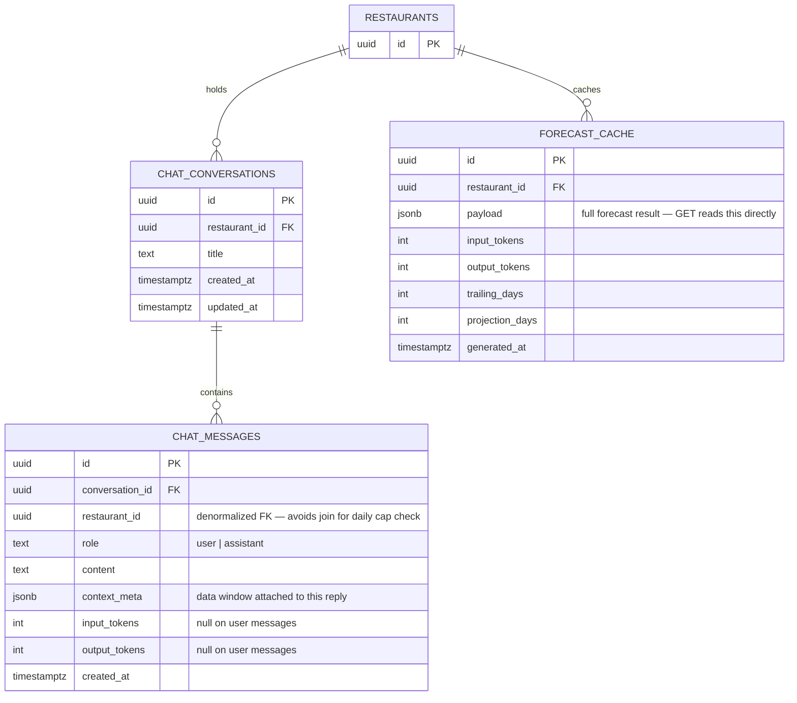

# Database Schema

RestaurantIQ uses PostgreSQL via Supabase. **23 forward-only SQL migrations** define the full schema — no ORM, no auto-generated tables. Every index, constraint, and relationship is explicit and visible in `restaurantiq-backend/migrations/`.

All monetary values are stored as **integer cents** (e.g. `price_cents`, `total_cents`) to eliminate floating-point drift. Display formatting happens only in the frontend.

---

## Core business data

The five tables that represent real restaurant activity. Everything the analytics dashboard, margin analysis, and AI insights read comes from here.



---

## Operations & sync infrastructure

The tables that power the distributed sync scheduler, locking, and the alerts engine.



---

## AI features

Persistent AI chat and the purchasing forecast cache.



---

## Design thought process

### Multi-tenancy by column, not by schema

Every table carries `restaurant_id`. Every backend route resolves it from `req.user.sub` (the JWT `sub` claim issued by Supabase Auth) and appends `WHERE restaurant_id = $1` to every query. There are no shared rows, and no path for one restaurant to read another's data — the primary guard lives in code that runs on every request.

```
JWT sub → restaurants.user_id → restaurants.id → WHERE restaurant_id = $1
```

As a defense-in-depth backstop, migration `024_enable_rls_backstop.sql` enables Row-Level Security on every tenant table with **no** policies. The backend connects with the Supabase service-role key (which bypasses RLS), so this is purely additive — every query keeps working unchanged. Its purpose is to default-deny the `anon`/`authenticated` roles: if the public anon key the frontend ships ever reaches these tables via PostgREST directly, RLS returns zero rows instead of leaking data. Code-level scoping is still the primary enforcement; RLS is the safety net so a single missed `WHERE restaurant_id = $1` is no longer a cross-tenant leak at the database layer.

### All money as integer cents

`price_cents`, `total_cents`, `unit_price_cents`, `total_revenue_cents` — every monetary column is a plain integer. Floating-point arithmetic is never used for revenue, margin, or profit calculations. The only place `$` symbols and decimal points appear is in frontend formatting functions.

### Pre-computed aggregates alongside raw events

`orders` and `order_items` are kept verbatim from the POS, preserving the full audit trail. During ingestion, the persistence layer rebuilds `daily_summaries` for the trailing 30 days. Analytics queries read `daily_summaries` — they never scan raw `order_items` rows directly.

This means:
- New analytics queries start from a small, indexed summary table rather than a potentially large orders table.
- The write path (ingestion) and the read path (analytics) never compete for the same rows.
- Revenue history is preserved even when a menu item is deleted. `daily_summaries.menu_item_id` is `ON DELETE SET NULL`, not `ON DELETE CASCADE` — historical totals survive.

### Denormalization for hot-path queries

Two tables break strict 3NF on purpose:

**`chat_messages.restaurant_id`** is redundant — you can reach it via `chat_conversations`. But the daily message cap check counts user messages per restaurant per day. Adding `restaurant_id` directly lets that query hit a single-table index (`restaurant_id, role, created_at DESC`) without a join on the hot chat write path.

**`alerts.restaurant_id`** is also redundant (reachable via `menu_item_id → menu_items → restaurant_id`). The unread count query runs on every page load. Making it a one-clause `WHERE restaurant_id = $1 AND is_read = false` avoids a two-table join at the most frequently executed query site in the app.

Storage is cheap. Joins on hot paths compound at scale.

### Two-table sync architecture

`integration_sync_status` and `sync_jobs` look related but serve fundamentally different purposes:

| Table | Row count | Write pattern | Purpose |
|---|---|---|---|
| `integration_sync_status` | One per (restaurant, provider) | `UPDATE` in-place | Current health snapshot + per-restaurant mutex |
| `sync_jobs` | One per sync attempt, growing | `INSERT` only | Durable audit log + retry queue |

The `locked_at` column on `integration_sync_status` is the per-restaurant mutex. Lock acquisition is a single conditional `UPDATE … WHERE locked_at IS NULL OR locked_at < NOW() - interval '10 minutes'`. Postgres row-level locking serializes concurrent writers, so exactly one instance acquires the lock. The stale-window condition lets a crashed process's lock be reclaimed rather than wedging forever.

Retries live entirely in `sync_jobs` as rows with `status = 'pending_retry'` and a non-null `next_retry_at`. The scheduler picks them up on the next tick. There are no `setTimeout`s and no in-memory queues — retries survive crashes and rolling deploys. Backoff schedule: 0 s → 1 m → 5 m → 15 m → 60 m → `failed_permanently`. Auth failures go straight to `failed_permanently`; there is no point retrying a dead credential.

### Enforced singleton: scheduler_state

`scheduler_state` enforces `id = 1` via both a column `CHECK` constraint and a primary key. Only one row can ever exist. The migration inserts it with `ON CONFLICT (id) DO NOTHING`, so the "row not found" case never occurs in application code. The elected leader instance writes its ID and heartbeat timestamp; monitoring and the sync-metrics endpoint read it.

### Forward-only migrations, no ORM

All 23 migrations are plain SQL files applied in order by a custom runner (`src/scripts/migrate.ts`) that records each name in a `schema_migrations` table. No ORM is used anywhere in the backend. Every index, constraint, and query plan is written explicitly and visible in the source. Reading the migrations in order is reading the full history of every schema decision.

### OAuth tokens encrypted at rest

`square_access_token`, `square_refresh_token`, `doordash_access_token`, and `doordash_refresh_token` on the `restaurants` table are AES-256-GCM encrypted before being written and decrypted after being read. The `TOKEN_ENCRYPTION_KEY` environment variable (32-byte hex) is the only secret. The encryption layer (`src/lib/tokenCrypto.ts`) supports key rotation — old ciphertexts can be re-encrypted without revoking live tokens.

---

## Migration history

| # | Migration | What changed |
|---|---|---|
| 001 | *(initial schema)* | `restaurants`, `menu_items`, `orders`, `order_items`, `daily_summaries`, `alerts` |
| 002 | `square_integration` | Rename `toast_guid` → `square_location_id`; add `square_access_token`; extend `source` CHECK |
| 003a | `restaurants_user_id` | Add `restaurants.user_id` (FK to auth.users) |
| 003b | `daily_summaries_menu_item_fk` | Formalize the `daily_summaries → menu_items` FK required for Supabase embed joins |
| 004 | `restaurants_user_id_not_null` | Make `user_id` NOT NULL after backfill |
| 005 | `menu_items_external_id` | Add `menu_items.external_id` for idempotent POS upserts |
| 006 | `orders_source_square` | Extend `orders.source` CHECK to include `square` |
| 007 | `order_items_fks` | Add FKs from `order_items` to `orders` and `menu_items` |
| 008 | `menu_items_unique_constraint` | Add `UNIQUE (restaurant_id, source, external_id)` to enable upsert-on-conflict |
| 009 | `alerts_engine` | Add `severity`, `title`, `message`, `metadata` to `alerts`; add dedup index |
| 010 | `alerts_dedup_key` | Covering index for alert deduplication window queries |
| 011 | `alerts_type_check` | Extend `alerts.type` CHECK: `unusual_spike`, `traffic_drop` |
| 012 | `alerts_list_index` | Index on `(restaurant_id, is_read, created_at DESC)` for list queries |
| 013 | `restaurants_user_id_unique` | `UNIQUE` constraint on `restaurants.user_id` (one restaurant per user) |
| 014 | `daily_summaries_unique` | `UNIQUE (restaurant_id, menu_item_id, date)` for upsert-on-conflict |
| 015 | `orders_external_id` | Add `orders.external_id` for order-level deduplication |
| 016 | `doordash_integration` | Add `doordash_access_token`, `doordash_refresh_token`, `doordash_token_expires_at` |
| 017 | `square_token_refresh` | Add `square_refresh_token`, `square_token_expires_at` (mirrors DoorDash pattern) |
| 018 | `integration_sync_status` | New table: per-restaurant per-provider health snapshot + mutex |
| 019 | `sync_jobs` | New table: append-only audit log and retry queue for the distributed scheduler |
| 020 | `scheduler_state` | New singleton table: leader election observability |
| 021 | `chat_conversations` | New tables: `chat_conversations` + `chat_messages` for persistent AI chat |
| 022 | `forecast_cache` | New table: cached purchasing forecast payloads |
| 023 | `alerts_type_check_chat` | Extend `alerts.type` CHECK to include `chat_flagged` |
